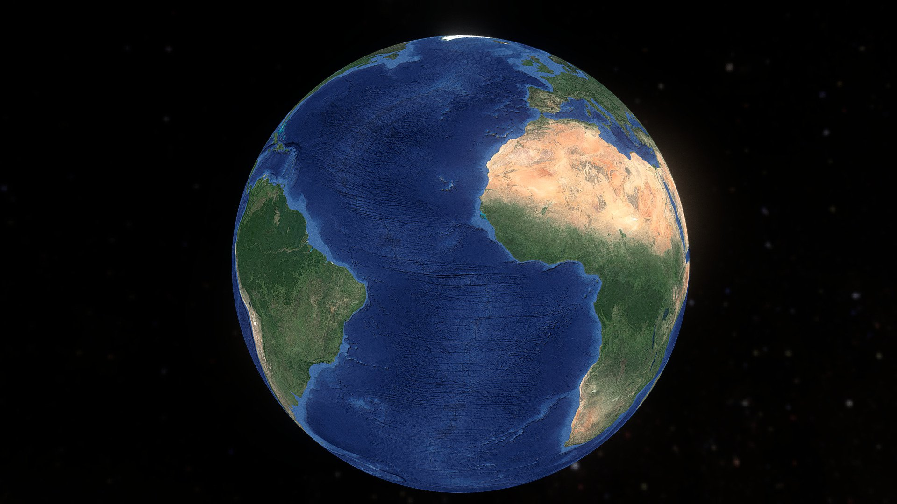

# World News Globe

An interactive 3D globe that visualizes live global news and real-world events by geographic location. News articles from free RSS feeds are plotted on a spinning Earth — click any marker to read the full story.



## Features

- **Live 3D Earth** — photorealistic globe with day/night textures, cloud layer, and atmospheric rim glow, built with Three.js
- **Real-time news** — articles fetched from 19+ free RSS feeds (BBC, NPR, The Guardian, Al Jazeera, Reuters, NYT, and more) plus USGS earthquake data
- **9-category event taxonomy** — each story is classified and color-coded:
  - 🔴 Disaster — earthquakes, floods, wildfires, storms
  - 🟠 Conflict — war, protests, military action
  - 🔵 Science — research, space, archaeology
  - 🔷 Technology — AI, startups, cybersecurity
  - 🟡 Politics — elections, legislation, diplomacy
  - 🟢 Business — markets, economy, trade
  - 🟩 Health — medicine, outbreaks, clinical trials
  - 🟦 Environment — climate, conservation, pollution
  - ⚪ General — everything else
- **Location confidence** — each article's geolocation includes a precision level (city, country, or exact coordinate) and a confidence score
- **Article enrichment** — when the RSS feed lacks a summary or image, the server fetches the article page and extracts Open Graph metadata for a real preview
- **Country filter** — search by country to focus the globe on a specific region
- **Interactive controls** — drag to rotate, scroll to zoom, click markers for details; full touch support for mobile
- **Responsive layout** — globe on top with scrolling news list below on mobile; side-by-side on desktop

## Tech Stack

| Layer | Technology |
|-------|-----------|
| Frontend | React 18, TypeScript, Vite |
| 3D Rendering | Three.js |
| Styling | Tailwind CSS |
| Backend | Supabase Edge Functions (Deno) |
| Data Sources | RSS feeds, USGS GeoJSON, optional GNews + Guardian APIs |

## Architecture

```
┌─────────────────────────────────────────────────┐
│  Browser (React + Three.js)                      │
│                                                  │
│  ┌───────────┐     ┌──────────────────────────┐  │
│  │ 3D Globe  │     │ News Sidebar             │  │
│  │ (markers) │     │ (category-colored list)  │  │
│  └─────┬─────┘     └───────────┬──────────────┘  │
│        │      Detail Panel     │                 │
│        └──────────┬────────────┘                 │
│                   │                              │
│         useNews() hook (fetch + poll)            │
└───────────────────┬─────────────────────────────┘
                    │ HTTPS (Bearer anon key)
                    ▼
┌─────────────────────────────────────────────────┐
│  Supabase Edge Function: /functions/v1/news     │
│                                                  │
│  1. Fetch RSS feeds (parallel, 8s timeout)       │
│  2. Parse XML → NewsItem[]                       │
│  3. Geocode via city/country lookup tables        │
│  4. Categorize via keyword scoring (9 categories) │
│  5. Enrich: fetch article pages for OG metadata  │
│  6. Return JSON (up to 200 items)                 │
└─────────────────────────────────────────────────┘
```

## Data Sources

### Always active (no API key needed)
- BBC World / Science / Technology
- Al Jazeera
- NPR World / National / Science / Tech
- Deutsche Welle
- Reuters (via Google News)
- The Guardian World / Science / Technology
- New York Times (via Google News)
- Sydney Morning Herald
- Japan Today
- Times of India
- Jerusalem Post
- USGS Earthquakes (M4.5+ last 24h)

### Optional (add API keys for more coverage)
- **GNews API** — `GNEWS_API_KEY` for top headlines across 5 topics
- **The Guardian API** — `GUARDIAN_API_KEY` for full-text article search

## Setup

### Prerequisites
- Node.js 18+
- A Supabase project (free tier works)

### Install
```bash
npm install
```

### Configure environment
Copy `.env.example` to `.env` and fill in your Supabase credentials:
```bash
cp .env.example .env
```

Required variables:
```
VITE_SUPABASE_URL=https://your-project.supabase.co
VITE_SUPABASE_ANON_KEY=your-anon-key
```

Optional (for enriched news):
```
GNEWS_API_KEY=your-key       # Set as Supabase Edge Function secret
GUARDIAN_API_KEY=your-key    # Set as Supabase Edge Function secret
```

### Run locally
```bash
npm run dev
```

### Build for production
```bash
npm run build
```

## Environment Variables

| Variable | Where | Required | Purpose |
|----------|-------|----------|---------|
| `VITE_SUPABASE_URL` | `.env` | Yes | Supabase project URL |
| `VITE_SUPABASE_ANON_KEY` | `.env` | Yes | Supabase anon key (safe for client with RLS) |
| `GNEWS_API_KEY` | Supabase secret | No | Enables GNews API articles |
| `GUARDIAN_API_KEY` | Supabase secret | No | Enables Guardian API articles |

> **Security note:** The Supabase anon key is designed for client-side use and is safe to include in frontend code when Row Level Security is enabled. This project reads it from `import.meta.env` — no keys are hardcoded in source files.

## Limitations

- **Geocoding is keyword-based** — articles are located by matching city/country names in the headline and summary. Stories that don't mention a recognizable place are filtered out.
- **RSS rate limits** — some feeds may throttle or block; the server handles this gracefully with 8-second timeouts.
- **Enrichment latency** — fetching article pages for summaries and images adds 2-5 seconds on first load (only for items missing data).
- **No persistence** — news is fetched fresh on each load; there is no database storage.
- **English only** — all RSS feeds are English-language sources.

## Roadmap

- [ ] WebSocket live updates (push new articles without polling)
- [ ] Time slider / historical replay
- [ ] User bookmarks and saved searches
- [ ] Multi-language sources
- [ ] Machine-learning geocoding (NER-based) for higher accuracy
- [ ] Heatmap overlay for event density
- [ ] Mobile-optimized marker clustering

## License

MIT
